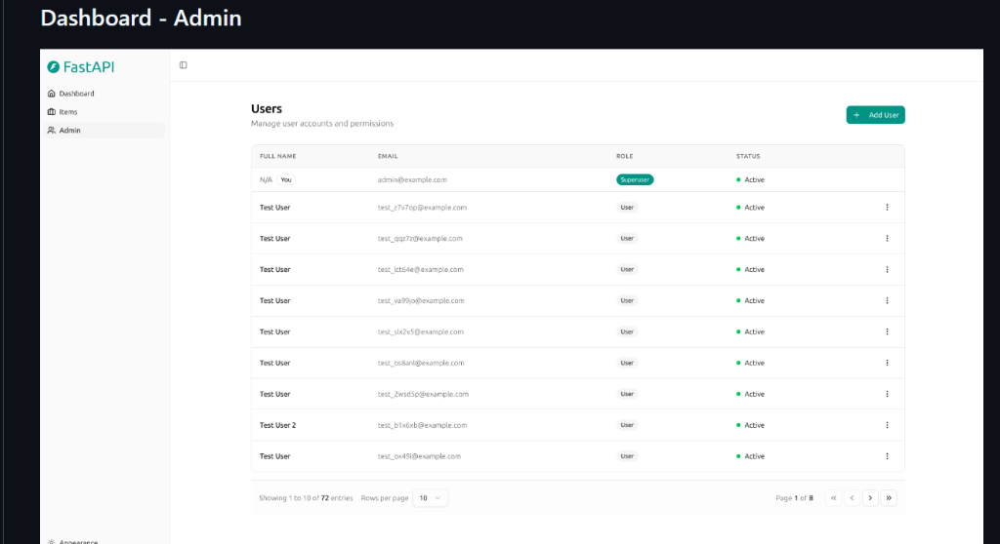
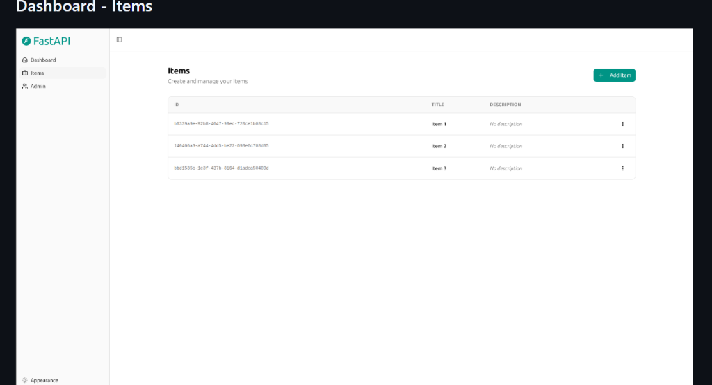
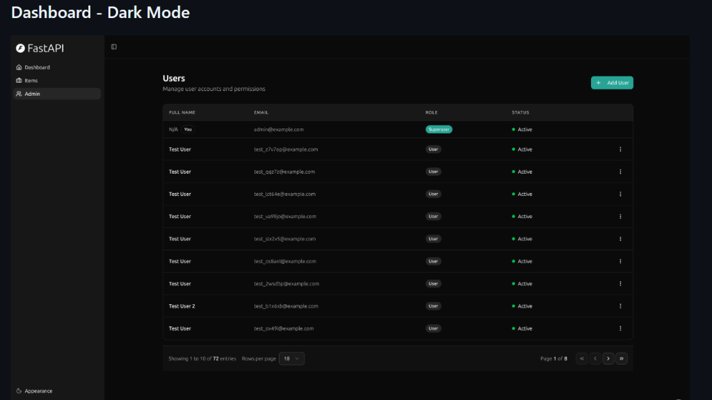
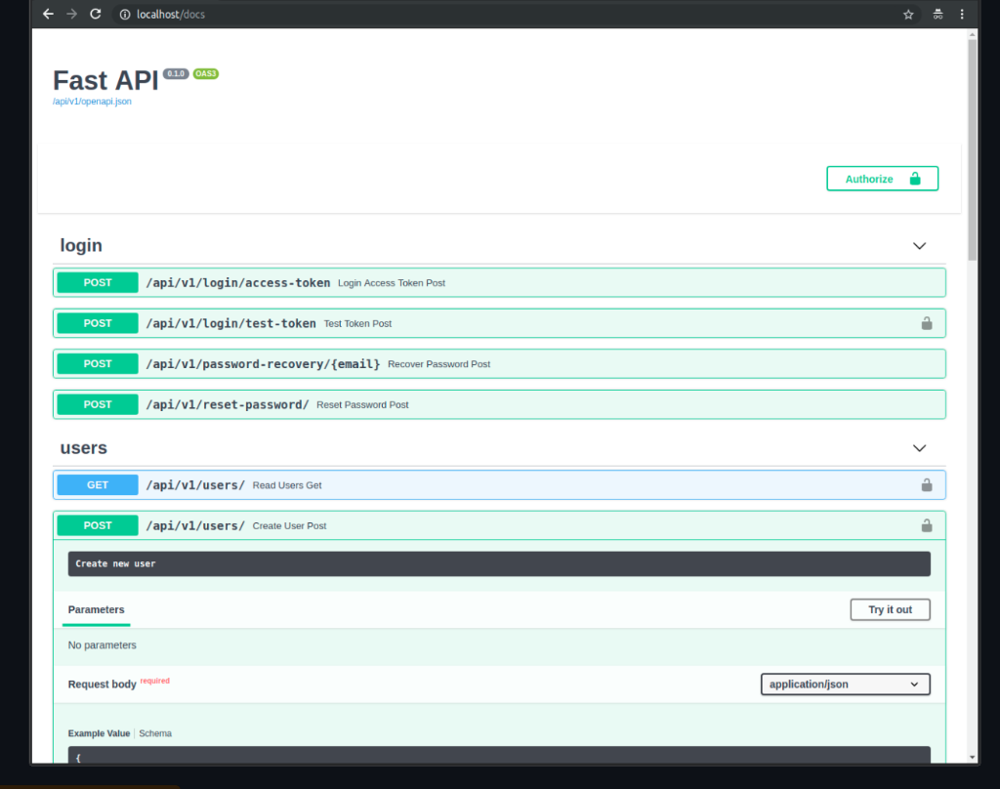

# Modern FastAPI App

A modern full-stack web application built with **FastAPI** on the backend and **React** on the frontend. The project combines typed API development, a contemporary admin-style UI, Docker-based local setup, and a clean developer experience for full-stack iteration.

## Tech Stack

- Backend: FastAPI, PostgreSQL, SQLModel, Pydantic
- Frontend: React, Vite, TypeScript, Tailwind CSS, TanStack Router
- Database: PostgreSQL
- DevOps: Docker Compose

## Getting Started

To run the project locally:

### Prerequisites

- Docker and Docker Compose
- Node.js
- Python 3.10+

### Recommended Local Run

```bash
docker compose up -d
```

After startup:

- frontend: `http://localhost:5173`
- backend docs: `http://localhost:8000/docs`

## Screenshots

| Admin Dashboard | Items Management |
| --- | --- |
|  |  |

| Dark Mode | API Documentation |
| --- | --- |
|  |  |

## Project Structure

- `backend/`: FastAPI application code
- `frontend/`: React application code
- `scripts/`: helper scripts for development and deployment

## Why This Project Stands Out

- clean separation between backend and frontend concerns
- typed Python API development with FastAPI
- modern React UI setup with Vite and TypeScript
- dashboard-style interface backed by real API endpoints
- Docker-first local development workflow

## License

This project is licensed under the MIT License.

---

Based on the [Full Stack FastAPI Template](https://github.com/fastapi/full-stack-fastapi-template).
